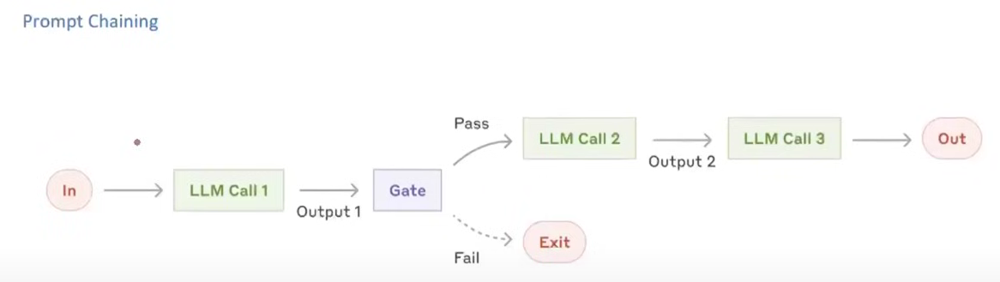
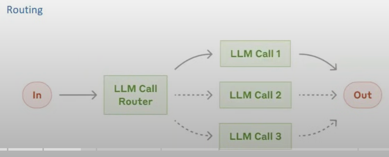
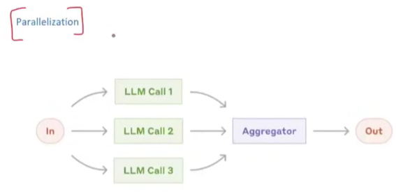
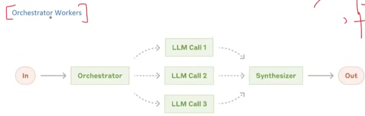
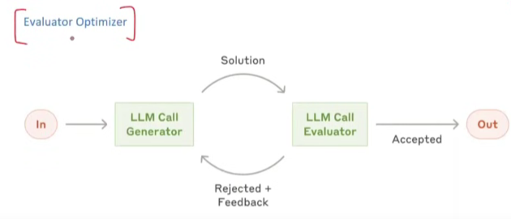
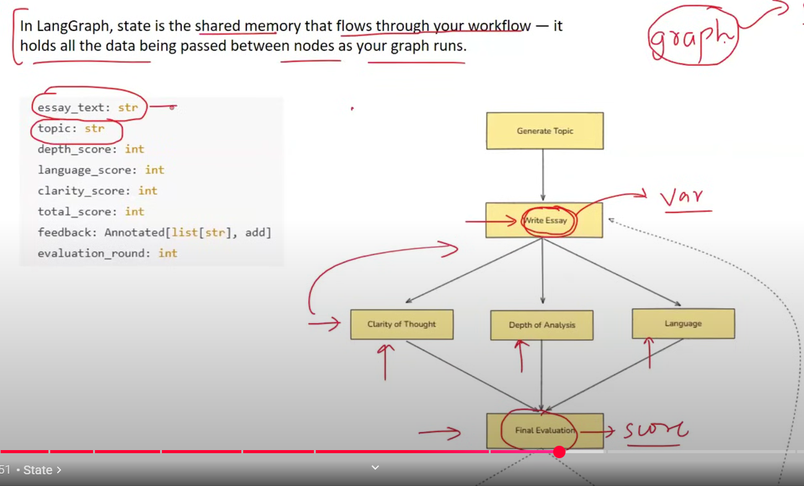
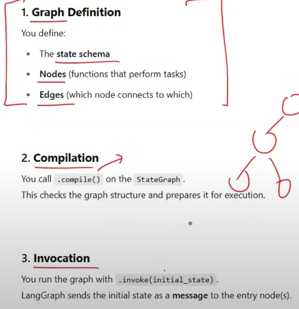
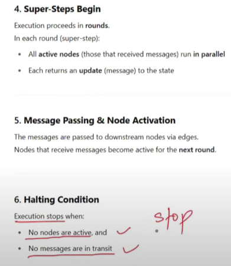

# LangGraph

It has nodes and edges for creating workflows. It also has state to track what has happened till now and for memory. Every node can access that state and can also edit that state.

## Workflow

1. Sequential
2. Event Driven

If there occurs any errors on any node, then langGraph can resume from that same node afterwards.

Human in the loop is there in langGraph

Nested Workflows can be made (Can build multi-agent system with this)

## Common Workflows

Call LLMs multiple times in series

Orchestrator decides which LLMs to call

## State

## Reducers

Reducers in LangGraph define how updates from nodes are applied to the shared
state.
Each key in the state can have its own reducer, which determines whether new
data replaces, merges, or adds to the existing value.

## LangGraph Execution Model

