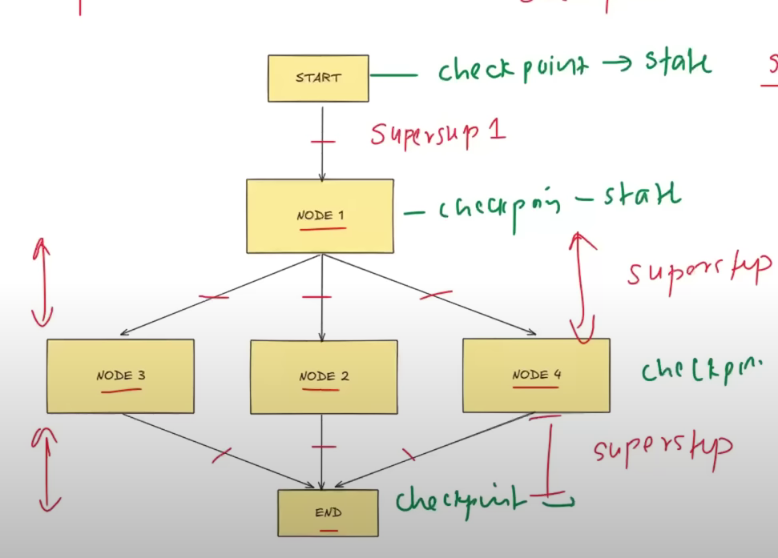

# Persistence

Ability to save ad restore the state of a workflow over time.

It not only store the final state, but also stores the intermediary states. 

If some fault occurs at node i, then it can again resume from that node as the state till that node is there in memory/database

Persistence is required for resuming older chats

There are checkpoints on every super step 
